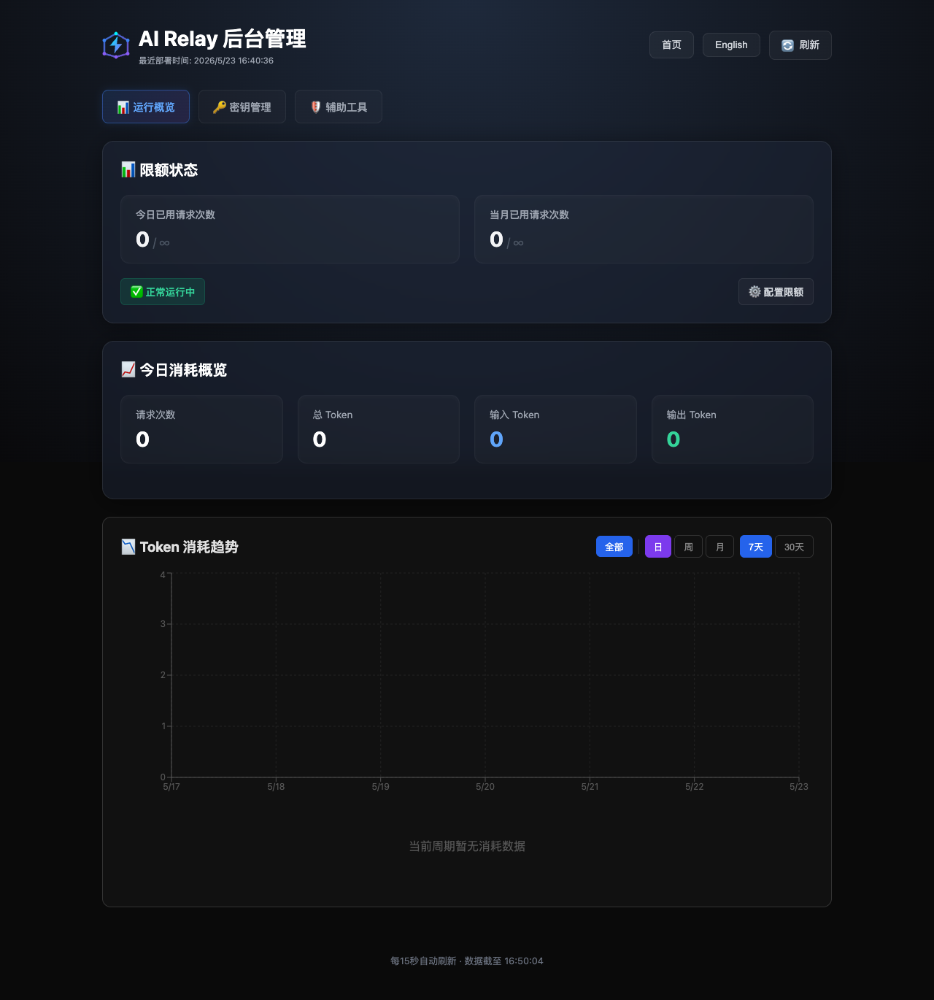
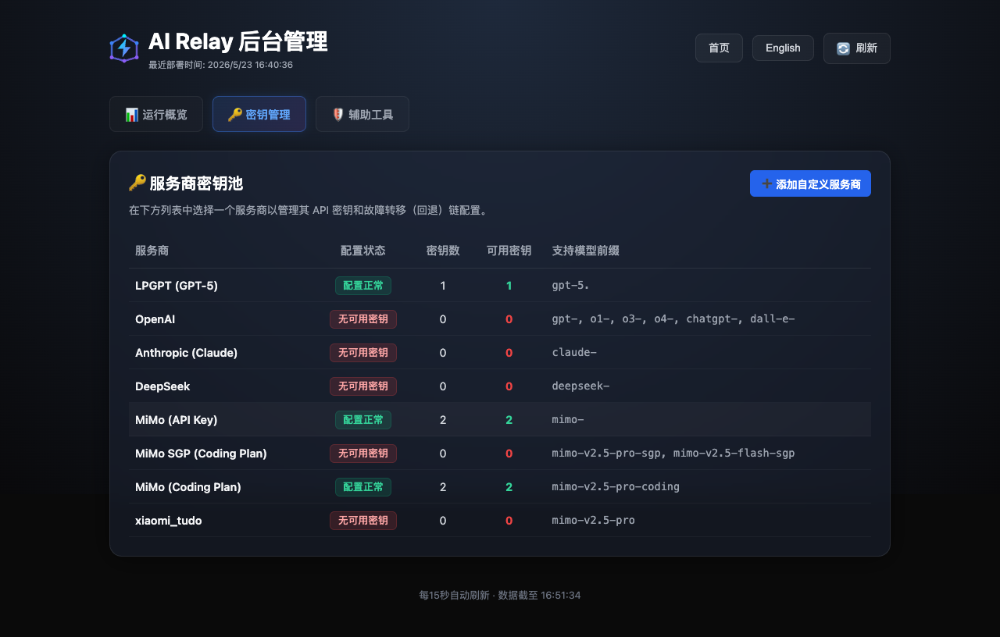

<div align="center">

# ⚡ AI Relay

**A lightweight, open-source AI API relay service built on Vercel Edge Runtime**

[](https://vercel.com/new/clone?repository-url=https://github.com/ParsifalC/ai-relay&env=RELAY_API_KEY,RELAY_ADMIN_KEY,RELAY_SIGNING_SECRET&envDescription=API%20authentication%20keys%20(required%20for%20security)&envLink=https://github.com/ParsifalC/ai-relay#environment-variables)
[](LICENSE)
[](https://nextjs.org/)
[](https://vercel.com/docs/functions/edge-functions)
[](https://vercel.com/docs/storage/vercel-kv)

[English](#english) · [中文](#中文)

</div>

---

<a name="english"></a>
## English

### ✨ Features

- **Multi-Key Rotation** — Round-Robin with automatic 429 backoff
- **Multi-Provider Routing** — OpenAI · Claude · DeepSeek · MiMo · Custom
- **Multi-Level Fallback** — Provider → Key chain failover
- **Circuit Breaker** — Automatic failover when provider is down
- **Admin Dashboard** — Full management panel at `/admin`
  - Key management (add / delete / test connectivity)
  - Quota configuration with KV persistence
  - Model connectivity testing
  - Temporary API key generation (HMAC-SHA256 signed)
  - Custom provider management (CRUD)
  - Real-time key pool sync
- **Usage Tracking** — Request counts + token usage via Vercel KV
- **Streaming Responses** — SSE pass-through for real-time output
- **OpenAI Compatible** — Works directly with the OpenAI SDK
- **Key Segregation** — Separate admin / API / temporary keys
- **Health Check** — `/health` endpoint for monitoring
- **Virtual Model Mapping** — Map virtual model names to real models
- **One-Click Deploy** — Deploy to Vercel in under 2 minutes

### 📸 Screenshots

**Admin Dashboard — Overview**



Quota status, daily usage stats, and token consumption trends at a glance.

**Admin Dashboard — Key Management**



Multi-provider key pool with status indicators and model prefix mapping.

**Admin Dashboard — Tools**


Temporary key generation and model connectivity testing.

### 🚀 Quick Start

#### One-Click Deploy (Recommended)

> **Prerequisites:** A [Vercel account](https://vercel.com/signup) (free tier works) and at least one AI provider API key.

1. Click the **Deploy with Vercel** button at the top of this README
2. Fill in the 3 required environment variables:
   - `RELAY_API_KEY` — Client request auth key (choose any strong secret)
   - `RELAY_ADMIN_KEY` — Admin dashboard login key (can be the same as above)
   - `RELAY_SIGNING_SECRET` — Secret for signing temporary keys (can be the same as above)
3. Click **Deploy** — done!

**After Deployment:**
1. Visit `https://your-project.vercel.app/health` to verify it's running
2. Visit `https://your-project.vercel.app/admin` and log in with your `RELAY_ADMIN_KEY`
3. Go to **Provider Keys** and add your API keys (OpenAI, Claude, etc.)
4. Start making requests!

#### Manual Setup

```bash
git clone https://github.com/ParsifalC/ai-relay.git
cd ai-relay
npm install

cp .env.local.example .env.local
# Edit .env.local and fill in your API keys

npm run dev  # http://localhost:3000
npx vercel   # deploy to Vercel
```

### 📖 Usage

**Endpoint:**
```
POST https://your-project.vercel.app/v1/chat/completions
```

**curl:**
```bash
curl -X POST https://your-project.vercel.app/v1/chat/completions \
  -H "Authorization: Bearer YOUR_RELAY_API_KEY" \
  -H "Content-Type: application/json" \
  -d '{"model": "gpt-4o", "messages": [{"role": "user", "content": "Hello!"}]}'
```

**OpenAI SDK:**
```python
from openai import OpenAI

client = OpenAI(
    api_key="YOUR_RELAY_API_KEY",
    base_url="https://your-project.vercel.app/v1"
)

response = client.chat.completions.create(
    model="gpt-4o",
    messages=[{"role": "user", "content": "Hello!"}]
)
```

**Temporary Keys:**
Generate time-limited keys in the Admin panel.
- **Format:** `***${base64Payload}.${signature}`
- **Validation:** Stateless HMAC-SHA256 verification on Vercel Edge

### 🔧 Configuration

#### Environment Variables

| Variable | Description | Required |
|----------|-------------|----------|
| `RELAY_API_KEY` | Client request auth key (comma-separated) | ✅ |
| `RELAY_ADMIN_KEY` | Admin dashboard login key (comma-separated, falls back to `RELAY_API_KEY`) | ⬜ |
| `RELAY_SIGNING_SECRET` | Temporary key signing secret (falls back to admin/api key) | ⬜ |
| `OPENAI_KEYS` | OpenAI API Keys (comma-separated) | ⬜ |
| `CLAUDE_KEYS` | Anthropic API Keys | ⬜ |
| `DEEPSEEK_KEYS` | DeepSeek API Keys | ⬜ |
| `XIAOMI_KEYS` | Xiaomi API Keys | ⬜ |

> [!NOTE]
> Provider keys (OPENAI_KEYS, etc.) are configured via the Admin panel after deployment, not as Vercel environment variables. Keys are stored in Vercel KV, not in your repo.

#### Supported Providers

| Provider | Models | Status |
|----------|--------|--------|
| OpenAI | gpt-4o, gpt-4, gpt-3.5-turbo, … | ✅ Built-in |
| Anthropic (Claude) | claude-3.5-sonnet, claude-3-opus, … | ✅ Built-in |
| DeepSeek | deepseek-chat, deepseek-coder, … | ✅ Built-in |
| Xiaomi (MiMo) | mimo-7b, … | ✅ Built-in |
| Custom | Any OpenAI-compatible API | ✅ Configurable |

### 🏗️ Architecture

```
Client → Edge Runtime (global, <50ms latency)
              ├─ Circuit Breaker
              ├─ Multi-Level Fallback (Provider → Key)
              ├─ Key Rotation (Round-Robin + 429 backoff)
              └─ Vercel KV (keys, quotas, usage)
```

### 📊 Admin Dashboard

Access at `/admin` with your `RELAY_ADMIN_KEY`:

| Feature | Description |
|---------|-------------|
| **Provider Keys** | Manage API keys for all providers |
| **Quota Config** | Set dynamic quotas per provider |
| **Model Testing** | Test connectivity to specific models |
| **Temporary Keys** | Generate time-limited API keys |
| **Custom Providers** | Add / edit / delete custom providers |
| **Usage Stats** | View request counts and token usage |
| **Key Pool Status** | Real-time sync status of all keys |

### 🏁 Comparison with Similar Projects

AI Relay is a **lightweight, self-deployable relay layer** — not a full platform. Here's how it differs from other popular solutions:

| Feature | AI Relay | OpenRouter | OneAPI / new-api | FastGPT |
|---------|----------|------------|------------------|---------|
| **Deployment** | Vercel one-click (Edge) | SaaS only | Self-hosted (Docker) | Self-hosted (Docker) |
| **Infra Cost** | Free (Vercel free tier) | Pay-per-use | Requires server | Requires server |
| **Cold Start** | < 50ms (Edge) | N/A (SaaS) | Seconds | Seconds |
| **Admin UI** | ✅ Built-in | ✅ Web dashboard | ✅ Web dashboard | ✅ Web dashboard |
| **Multi-Key Rotation** | ✅ Round-robin + 429 backoff | ✅ Managed | ✅ | ✅ |
| **Circuit Breaker** | ✅ Provider-level | ❌ | ❌ | ❌ |
| **Fallback Chains** | ✅ Provider → Key (configurable) | ✅ Auto | ✅ Basic | ✅ Basic |
| **Concurrency Control** | ✅ Token bucket + queue | Rate-limited | ❌ | ❌ |
| **Webhook Alerts** | ✅ WeCom/Feishu/DingTalk/Slack | ❌ | ❌ | ✅ Webhook |
| **Virtual Model Mapping** | ✅ | ✅ | ✅ | ✅ |
| **Temp API Keys** | ✅ HMAC-SHA256 signed | ❌ | ✅ | ✅ |
| **OpenAI Compatible** | ✅ | ✅ | ✅ | Partial |
| **Primary Use Case** | Personal / small team relay | API marketplace | Multi-key management | Knowledge base + API |

**When to choose AI Relay:**
- You want a **zero-cost, serverless** relay that deploys in 2 minutes
- You need **multi-provider fallback** with circuit breaker protection
- You prefer **Edge Runtime** for global low-latency access
- You don't need a full platform — just a reliable API proxy layer

**When to choose alternatives:**
- **OpenRouter**: You want access to 100+ models via a managed marketplace with billing built in
- **OneAPI / new-api**: You need a mature self-hosted solution with extensive token management and user systems
- **FastGPT**: You're building a knowledge-base application and need integrated RAG capabilities

### 🙏 Acknowledgments & References

AI Relay stands on the shoulders of these excellent open-source projects:

- **[OpenRouter](https://openrouter.ai)** — Pioneered the multi-provider API aggregation model; demonstrated that unified endpoints dramatically simplify AI application development
- **[OneAPI](https://github.com/songquanpeng/one-api) / [new-api](https://github.com/Calcium-Ion/new-api)** — The go-to open-source API management system; inspired our multi-key rotation and quota management design
- **[FastGPT](https://github.com/labring/FastGPT)** — Showed how API relay can be tightly integrated with knowledge-base workflows; our webhook system draws from their notification architecture
- **[Vercel](https://vercel.com)** — Edge Runtime and KV storage make serverless AI relay possible with zero infrastructure overhead
- **[OpenAI](https://platform.openai.com)** — The OpenAI-compatible API standard has become the de facto interface for LLM services

### 🎯 Use Cases

| Scenario | Description |
|----------|-------------|
| **Individual Developers** | Consolidate multiple API keys into a single endpoint; never hit rate limits mid-debugging thanks to automatic key rotation and fallback |
| **Small Teams / Startups** | Share a relay instance across the team with quota management; admin dashboard provides visibility without exposing raw API keys |
| **CI/CD Pipelines** | Use temporary HMAC-signed keys for ephemeral build agents; keys auto-expire, no cleanup needed |
| **Multi-Region Apps** | Edge Runtime ensures < 50ms latency worldwide; circuit breaker prevents cascading failures when a provider has regional outages |
| **Cost Optimization** | Route requests to cheaper providers (e.g., DeepSeek for simple tasks, GPT-4o for complex ones) via virtual model mapping |
| **Enterprise Internal Tools** | Deploy as an internal API gateway with webhook alerts to WeCom/Feishu/DingTalk for usage monitoring and anomaly detection |

---

### 🤝 Contributing

Contributions are welcome! Please feel free to submit a Pull Request.

1. Fork the repository
2. Create your feature branch (`git checkout -b feature/amazing-feature`)
3. Commit your changes (`git commit -m 'Add amazing feature'`)
4. Push to the branch (`git push origin feature/amazing-feature`)
5. Open a Pull Request

### 📄 License

This project is licensed under the MIT License — see the [LICENSE](LICENSE) file for details.

---

<a name="中文"></a>
## 中文

### ✨ 特性

- **多 Key 轮换** — Round-Robin + 429 自动退避
- **多 Provider 路由** — OpenAI · Claude · DeepSeek · MiMo · 自定义
- **多级 Fallback** — Provider → Key 链式故障转移
- **熔断器** — Provider 故障时自动切换
- **Admin 后台** — 全功能管理面板 `/admin`
  - 密钥管理（添加 / 删除 / 测试连通性）
  - 配额配置（动态覆盖，KV 持久化）
  - 模型连通性测试
  - 临时 API Key 生成（HMAC-SHA256 签名）
  - 自定义 Provider 管理（CRUD）
  - 实时 Key Pool 同步
- **用量追踪** — 调用次数 + Token 用量（Vercel KV）
- **流式响应** — SSE 透传，实时输出
- **OpenAI 兼容** — 直接用 OpenAI SDK 对接
- **密钥分离** — 区分 Admin Key / API Key / 临时 Key
- **健康检查** — `/health` 端点用于监控
- **虚拟模型映射** — 将虚拟模型名映射到真实模型
- **一键部署** — 2 分钟内部署到 Vercel

### 📸 截图展示

**管理后台 — 运行概览**


限额状态、今日消耗概览、Token 消耗趋势一目了然。

**管理后台 — 密钥管理**


多服务商密钥池，带状态指示和模型前缀映射。

**管理后台 — 辅助工具**


临时密钥生成和模型连通性测试。

### 🚀 快速开始

#### 一键部署（推荐）

> **前置条件：** 一个 [Vercel 账号](https://vercel.com/signup)（免费版即可）+ 至少一个 AI Provider 的 API Key。

1. 点击 README 顶部的 **Deploy with Vercel** 按钮
2. 填写 3 个必需的环境变量：
   - `RELAY_API_KEY` — 客户端请求鉴权密钥（自定义一个强密码即可）
   - `RELAY_ADMIN_KEY` — 后台管理登录密钥（可以和上面相同）
   - `RELAY_SIGNING_SECRET` — 临时 Key 签名密钥（可以和上面相同）
3. 点击 **Deploy** — 搞定！

**部署后：**
1. 访问 `https://你的项目.vercel.app/health` 确认服务正常
2. 访问 `https://你的项目.vercel.app/admin`，用 `RELAY_ADMIN_KEY` 登录
3. 在 **Provider Keys** 中添加你的 API Key（OpenAI、Claude 等）
4. 开始调用！

#### 手动部署

```bash
git clone https://github.com/ParsifalC/ai-relay.git
cd ai-relay
npm install

cp .env.local.example .env.local
# 编辑 .env.local 填入你的 API Keys

npm run dev  # http://localhost:3000
npx vercel   # 部署到 Vercel
```

### 📖 使用方法

**端点：**
```
POST https://你的项目.vercel.app/v1/chat/completions
```

**curl：**
```bash
curl -X POST https://你的项目.vercel.app/v1/chat/completions \
  -H "Authorization: Bearer YOUR_RELAY_API_KEY" \
  -H "Content-Type: application/json" \
  -d '{"model": "gpt-4o", "messages": [{"role": "user", "content": "你好！"}]}'
```

**OpenAI SDK：**
```python
from openai import OpenAI

client = OpenAI(
    api_key="YOUR_RELAY_API_KEY",
    base_url="https://你的项目.vercel.app/v1"
)

response = client.chat.completions.create(
    model="gpt-4o",
    messages=[{"role": "user", "content": "你好！"}]
)
```

**临时密钥：**
在后台面板中生成指定有效期的临时密钥。
- **格式：** `***${base64Payload}.${signature}`
- **校验：** Vercel Edge 服务端 HMAC-SHA256 无状态签名校验

### 🔧 配置

#### 环境变量

| 变量 | 说明 | 必填 |
|------|------|------|
| `RELAY_API_KEY` | 客户端请求鉴权密钥（逗号分隔） | ✅ |
| `RELAY_ADMIN_KEY` | 后台管理登录密钥（逗号分隔，未设置则回退到 `RELAY_API_KEY`） | ⬜ |
| `RELAY_SIGNING_SECRET` | 临时 Key 签名密钥（未设置则回退到管理/请求密钥） | ⬜ |
| `OPENAI_KEYS` | OpenAI API Keys（逗号分隔） | ⬜ |
| `CLAUDE_KEYS` | Anthropic API Keys | ⬜ |
| `DEEPSEEK_KEYS` | DeepSeek API Keys | ⬜ |
| `XIAOMI_KEYS` | Xiaomi API Keys | ⬜ |

> [!NOTE]
> Provider 密钥（OPENAI_KEYS 等）建议通过 Admin 后台面板配置，而非 Vercel 环境变量。密钥存储在 Vercel KV 中，不暴露在代码仓库里。

#### 支持的 Provider

| Provider | 模型 | 状态 |
|----------|------|------|
| OpenAI | gpt-4o, gpt-4, gpt-3.5-turbo, … | ✅ 内置 |
| Anthropic (Claude) | claude-3.5-sonnet, claude-3-opus, … | ✅ 内置 |
| DeepSeek | deepseek-chat, deepseek-coder, … | ✅ 内置 |
| Xiaomi (MiMo) | mimo-7b, … | ✅ 内置 |
| 自定义 | 任意 OpenAI 兼容 API | ✅ 可配置 |

### 🏗️ 架构

```
Client → Edge Runtime (全球分发, <50ms 延迟)
              ├─ 熔断器
              ├─ 多级 Fallback (Provider → Key)
              ├─ Key 轮换 (Round-Robin + 429 退避)
              └─ Vercel KV (密钥, 配额, 用量)
```

### 📊 Admin 后台

访问 `/admin` 使用 `RELAY_ADMIN_KEY` 登录：

| 功能 | 说明 |
|------|------|
| **Provider Keys** | 管理所有 Provider 的 API 密钥 |
| **配额配置** | 为每个 Provider 设置动态配额 |
| **模型测试** | 测试特定模型的连通性 |
| **临时密钥** | 生成有时效的 API 密钥 |
| **自定义 Provider** | 添加 / 编辑 / 删除自定义 Provider |
| **用量统计** | 查看请求次数和 Token 用量 |
| **Key Pool 状态** | 实时同步所有密钥状态 |

### 🏁 同类项目对比

AI Relay 的定位是**轻量级、自部署的中转层**，而非完整平台。以下是与主流方案的对比：

| 特性 | AI Relay | OpenRouter | OneAPI / new-api | FastGPT |
|------|----------|------------|------------------|---------|
| **部署方式** | Vercel 一键部署（Edge） | 纯 SaaS | 自托管（Docker） | 自托管（Docker） |
| **基础设施成本** | 免费（Vercel 免费层） | 按量付费 | 需要服务器 | 需要服务器 |
| **冷启动** | < 50ms（Edge） | N/A（SaaS） | 秒级 | 秒级 |
| **管理后台** | ✅ 内置 | ✅ Web 控制台 | ✅ Web 控制台 | ✅ Web 控制台 |
| **多 Key 轮换** | ✅ Round-robin + 429 退避 | ✅ 托管式 | ✅ | ✅ |
| **熔断器** | ✅ Provider 级别 | ❌ | ❌ | ❌ |
| **Fallback 链** | ✅ Provider → Key（可配置） | ✅ 自动 | ✅ 基础 | ✅ 基础 |
| **并发控制** | ✅ 令牌桶 + 队列 | 限流 | ❌ | ❌ |
| **Webhook 告警** | ✅ 企业微信/飞书/钉钉/Slack | ❌ | ❌ | ✅ Webhook |
| **虚拟模型映射** | ✅ | ✅ | ✅ | ✅ |
| **临时 API Key** | ✅ HMAC-SHA256 签名 | ❌ | ✅ | ✅ |
| **OpenAI 兼容** | ✅ | ✅ | ✅ | 部分 |
| **主要场景** | 个人 / 小团队中转 | API 市场 | 多 Key 管理 | 知识库 + API |

**选择 AI Relay 的场景：**
- 你想要一个**零成本、无服务器**的中转方案，2 分钟内部署完成
- 你需要**多 Provider 故障转移**和熔断保护
- 你偏好 **Edge Runtime** 带来的全球低延迟访问
- 你不需要完整平台，只需要一个可靠的 API 代理层

**选择其他方案的场景：**
- **OpenRouter**：你需要通过托管市场访问 100+ 模型，且希望内置计费功能
- **OneAPI / new-api**：你需要成熟的自托管方案，有完善的 Token 管理和用户体系
- **FastGPT**：你在构建知识库应用，需要集成 RAG 能力

### 🙏 致谢与参考

AI Relay 站在这些优秀开源项目的肩膀上：

- **[OpenRouter](https://openrouter.ai)** — 开创了多 Provider API 聚合模式，证明统一端点能极大简化 AI 应用开发
- **[OneAPI](https://github.com/songquanpeng/one-api) / [new-api](https://github.com/Calcium-Ion/new-api)** — 最流行的开源 API 管理系统，我们的多 Key 轮换和配额管理设计受其启发
- **[FastGPT](https://github.com/labring/FastGPT)** — 展示了 API 中转与知识库工作流的深度整合，我们的 Webhook 系统参考了其通知架构
- **[Vercel](https://vercel.com)** — Edge Runtime 和 KV 存储让无服务器 AI 中转成为可能，零基础设施开销
- **[OpenAI](https://platform.openai.com)** — OpenAI 兼容 API 标准已成为 LLM 服务的事实接口

### 🎯 使用场景

| 场景 | 说明 |
|------|------|
| **个人开发者** | 将多个 API Key 整合为单一端点；调试时不会因限流中断，自动 Key 轮换和故障转移保障连续性 |
| **小团队 / 创业公司** | 团队共享一个中转实例，配合配额管理；Admin 后台提供用量可见性，无需暴露原始 API Key |
| **CI/CD 流水线** | 使用 HMAC 签名的临时密钥为临时构建代理提供访问；密钥自动过期，无需手动清理 |
| **多地域应用** | Edge Runtime 确保全球 < 50ms 延迟；熔断器在 Provider 区域性故障时防止级联失败 |
| **成本优化** | 通过虚拟模型映射将请求路由到更便宜的 Provider（简单任务用 DeepSeek，复杂任务用 GPT-4o） |
| **企业内部工具** | 作为内部 API 网关部署，配合企业微信/飞书/钉钉 Webhook 告警，实现用量监控和异常检测 |

---

### 🤝 贡献

欢迎贡献！请随时提交 Pull Request。

1. Fork 本仓库
2. 创建特性分支 (`git checkout -b feature/amazing-feature`)
3. 提交更改 (`git commit -m 'Add amazing feature'`)
4. 推送到分支 (`git push origin feature/amazing-feature`)
5. 提交 Pull Request

### 📄 许可证

本项目基于 MIT 许可证 — 详见 [LICENSE](LICENSE) 文件。
